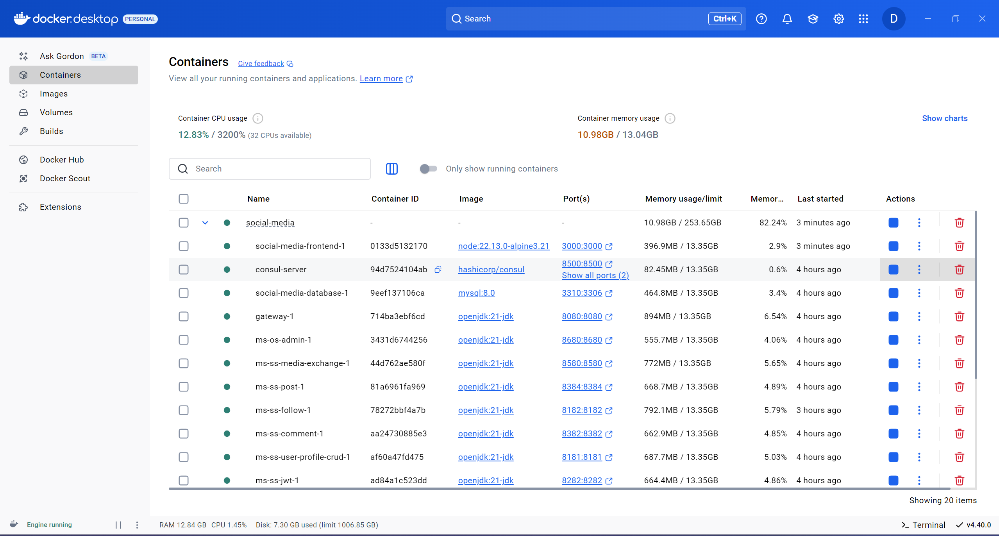
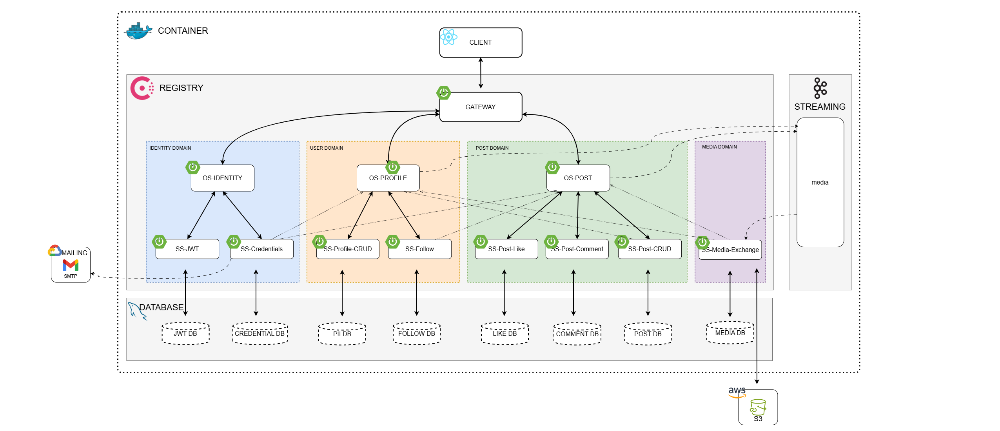

# Social Media Project
Social Media Project is a Twitter-like application designed to showcase the Microservice Architecture Pattern. It leverages technologies such as Spring Boot, Spring Cloud, Kafka, Consul, MySQL, React, and AWS S3.

The entire project is fully dockerized for seamless deployment.

# Content
- [How to Run](#how-to-run)
- [Project Structure](#project-structure)
  - [Container](#container)
  - [Client](#client)
  - [Registry](#registry)
  - [Gateway](#gateway)
  - [Domains](#domains)
  - [Streaming](#streaming)
  - [Database](#database)
  - [Object Storage](#object-storage)
  - [Mailing](#mailing)
- [Contributors](#contributors)

# How to Run
Clone this root repository and it's submodules by running: 

```
git clone --recurse-submodules https://github.com/desmondsyu/social-media.git
```

In the root repo (social-media), create a .env and add the following: 

```env
MYSQL_DATABASE=[your_database_name] 
MYSQL_ROOT_PASSWORD=[your_password] 
JWT_KEY=[generated_key(512)]
FRONT_END_URL=[front_end_url(http://localhost:3000)]
SMTP_USERNAME=[google_account]
SMTP_PASSWORD=[google_app_password]
AWS_REGION=[aws_region(ca-central-1)]
AWS_ACCESS_KEY_ID=[access_key]
AWS_SECRET_ACCESS_KEY=[secret_key]
AWS_S3_BUCKET_NAME=[S3_bucket_name]
```

For more information of SMTP credentials, visit https://support.google.com/accounts/answer/185833

In the root directory, deploy the whole project in Docker by running
```bash
docker compose up -d
```

To remove all container including volumes, run
```bash
docker compose down -v
```
There should be 19 containers running including
- 1 Database
- 1 Front End
- 1 Zookeeper
- 1 Kafka
- 1 Kafka UI
- 1 Consul
- 1 Gateway
- 4 Orchestrations
- 8 Choreography



In the Consul UI, should be 14 services running


One consumer and one topic in Kafka UI


# Project Structure


## Container
This directory contains the compose.yaml file and other container-related 
configurations that orchestrate the deployment of all microservices, databases, 
and supporting tools (like Kafka, Consul, etc.). It ensures seamless startup and 
teardown of the entire microservice ecosystem using Docker.

In the yaml it defines volume and working dir for each container. 
This could build the container without dockerfile.

## Client
The front-end application built with React. It communicates with the backend via
the API Gateway and provides an interactive UI for users to register, log in, create 
posts, follow/unfollow users, like, comment, and manage their profiles. This component 
is also responsible for consuming content and rendering media from AWS S3.

## Registry
The Service Registry built using HashiCorp Consul via Spring Cloud Consul. 
It enables service discovery by allowing all microservices to dynamically 
register themselves and query the location of other services. This decouples 
service communication and ensures fault-tolerant, scalable routing in a dynamic
microservices' environment.

## Gateway
A Spring Cloud Gateway service that acts as a unified entry point for all client
requests. It routes traffic to the appropriate backend services based on the URL 
path. It also handles cross-cutting concerns like authentication, logging, and 
CORS configuration.

## Domains
This directory contains the core business services, each built as an independent Spring Boot microservice following the Domain-Driven Design principle. Examples include services like:

User Service – Manages user registration, login, and profiles.

Post Service – Handles creation and retrieval of user posts.

Follow Service – Manages follow/unfollow logic and social connections.

Comment Service – Manages comments and interactions.

Each domain is responsible for its own data and logic, promoting loose coupling and high cohesion.

## Streaming
This module handles asynchronous messaging using Apache Kafka. 
Kafka enables event-driven communication between microservices, supporting both 
orchestration and choreography patterns. Services can publish and subscribe to 
image creations, enabling 
loose coupling and real-time updates.

This setup supports scalable and resilient event-driven architecture within the system.

## Database
Contains initialization scripts, SQL schemas, and Docker setup for the MySQL 
database. Each microservice may have its own schema (following the Database-per-Service
pattern), ensuring autonomy and encapsulation of data. All schemas are in one single database instance.

## Object Storage
Manages the integration with AWS S3 for storing and retrieving user-uploaded images or files. 
It includes service-level logic for upload handling, access permissions, 
and S3 bucket management.

## Mailing
Handles the email notification system using SMTP. It's responsible for  
password resets, and other notification emails. It’s configured to work with Gmail SMTP 
and uses secure application credentials.

# Contributors
| Name | N_ID |
| ----------- | ----------- |
| Marina Carvalho | N01606437 |
| Vitaly Sukhinin | N01605938 |
| Kexin Zhu | N01621302 |
| Samruddhi Chavan | N01604191 |
| Sruthi Pandiath | N01618202 |
